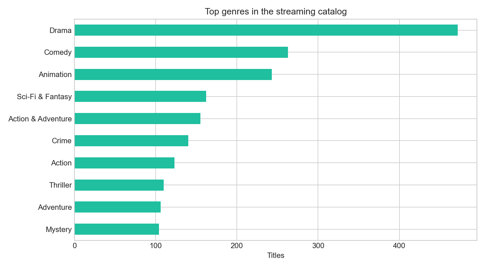
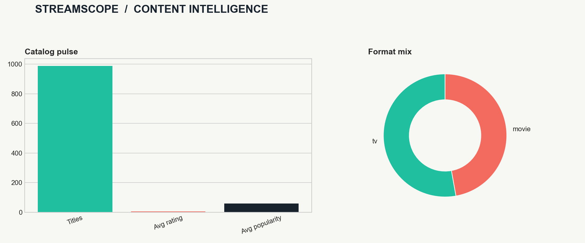

# StreamScope Project Report

## Objective

StreamScope turns `streaming_content_trends.csv` into an interactive catalog intelligence product with a Streamlit frontend and a Flask prediction API.

## Dataset

- Rows: **988**
- Columns: **14**
- Formats: **{'tv': 522, 'movie': 466}**
- Release years: **1921 to 2027**
- Mean audience rating: **7.33 / 10**

## Architecture

1. `train_model.py` cleans the catalog and trains a Random Forest regression model for audience rating.
2. `backend.py` serves health, model information, dataset summary, and prediction endpoints.
3. `ui.py` launches the Streamlit frontend from the existing `app.py` dashboard.
4. `collect_api_outputs.py` captures API responses under `api_outputs/`.
5. `generate_report.py` creates this report asset and a genre chart under `report_assets/`.

## Model evaluation

The training script writes `model_metrics.json` with holdout MAE and R-squared values. The model is intended as a demonstration of the project pipeline, not as a production recommendation system.

## Generated visual

